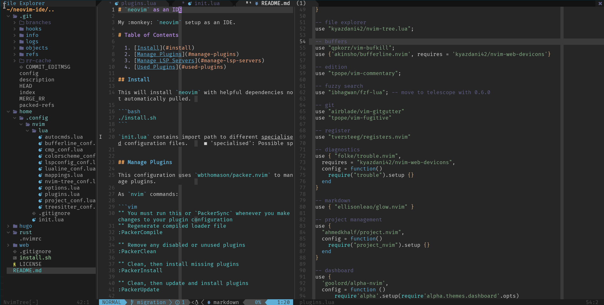
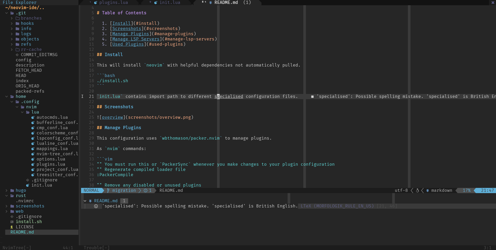
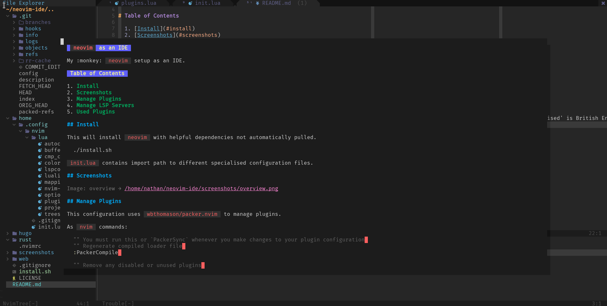
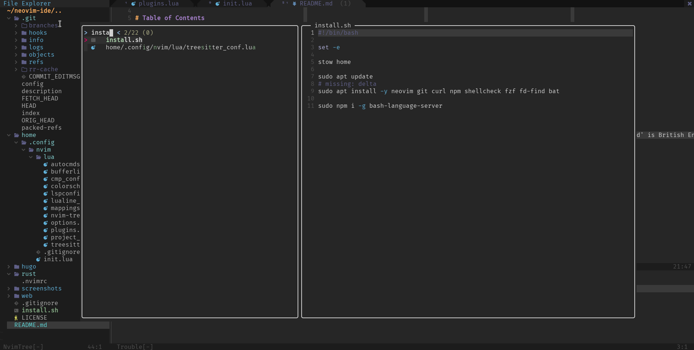
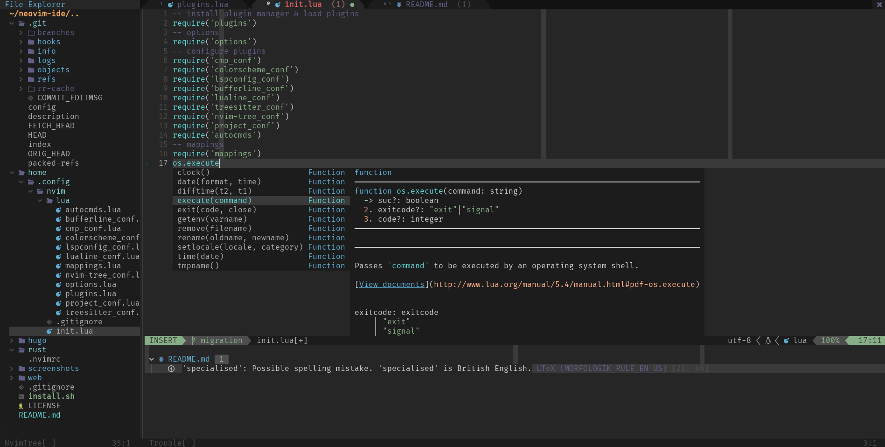

# `neovim` as an IDE

My :monkey: `neovim` setup as an IDE.

# Table of Contents

  1. [Install](#install)
  2. [Screenshots](#screenshots)
  3. [Manage Plugins](#manage-plugins)
  4. [Manage LSP Servers](#manage-lsp-servers)
  5. [Used Plugins](#used-plugins)

## Install

This will install `neovim` with helpful dependencies not automatically pulled.

```bash
./install.sh
```

`init.lua` contains import path to different specialised configuration files.

### First run

`packer.nvim` should automatically try to install the required packages.

To install LSP servers and Treesitter language parsers:
```vim
:LspInstall sumneko_lua
:LspInstall bashls
:LspInstall ltex
:TSInstall lua
:TSInstall bash
:TSInstall markdown
```

## Screenshots







## Manage Plugins

This configuration uses `wbthomason/packer.nvim` to manage plugins.

As `nvim` commands:

```vim
"" You must run this or `PackerSync` whenever you make changes to your plugin configuration
"" Regenerate compiled loader file
:PackerCompile

"" Remove any disabled or unused plugins
:PackerClean

"" Clean, then install missing plugins
:PackerInstall

"" Clean, then update and install plugins
:PackerUpdate

"" Perform `PackerUpdate` and then `PackerCompile`
:PackerSync
```

## Manage LSP Servers

This configuration uses `williamboman/nvim-lsp-installer` to manage LSP servers.

As `nvim` commands:

```vim
:LspInstall
```

Depending on the `filetype` used in the current buffer, you will be given a choice
of servers to install.

Make sure to configure `lspconfig` properly first by indicating the path to the
server's binary file, if it is not present in your path:

```lua
local nvim_data_path = os.getenv("HOME") .. "/.local/share/nvim/lsp_servers/"
require('lspconfig')['ltex'].setup {
  cmd = {  nvim_data_path .. "ltex/ltex-ls-15.2.0/bin/ltex-ls" }
}
```

## Used Plugins

  * Plugin Management
    * `packer.nvim`
  * LSP
    * `nvim-lspconfig`
    * `nvim-lsp-installer`
  * Completion
    * `nvim-cmp`
    * `vim-vsnip`
    * `cmp-cmdline`
    * `cmp-path`
    * `cmp-buffer`
    * `cmp-nvim-lsp`
    * `nvim-lspconfig`
  * Dashboard
    * `alpha-nvim`
  * Project Management
    * `project.nvim`
    * `todo-comments`
  * Rendering
    * `glow.nvim` for `markdown`
  * Diagnostics
    * `trouble.nvim`
  * Register
    * `registers.nvim`
  * Git
    * `fugitive`
    * `vim-gitgutter`
  * Fuzzy search
    * `fzf-lua`
  * Edition
    * `numToStr/Comment.nvim`
    * `nvim-autopairs`
    * `indent-blankline.nvim`
  * Buffers
    * `vim-bufkill`
    * `bufferline.nvim`
  * File Explorer
    * `nvim-tree.lua`
  * Fonts
    * `nvim-web-devicons`
  * Status Line
    * `lualine.nvim`
  * Color Scheme
    * `nightfox.nvim`
  * Configuration Helper
    * `vimpeccable`
    * `nvim-whichkey-setup.lua`
